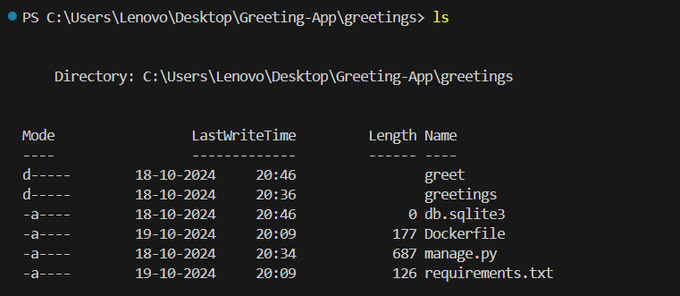
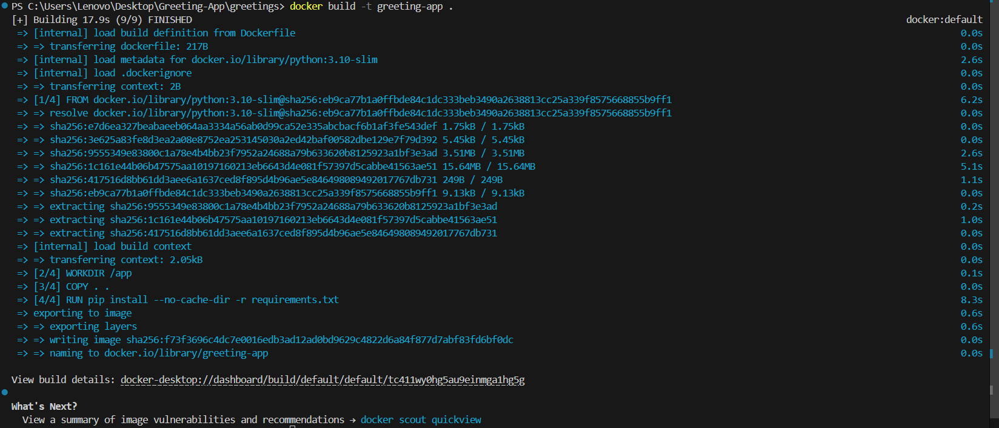
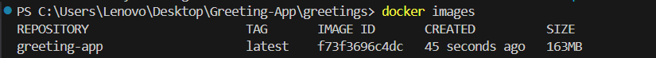
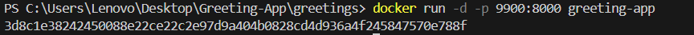
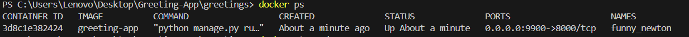
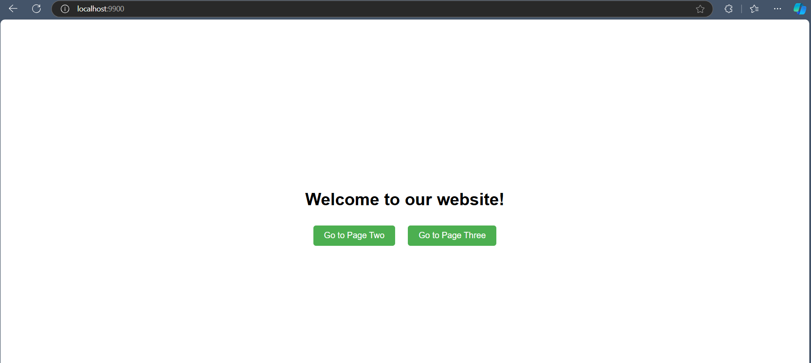
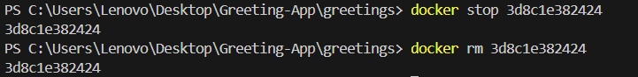

# Greetings Project

This project is a simple Django application that displays a series of greeting pages. Each page features a different CSS animation and is styled to work well on various screen sizes.

# Purpose

This project is for everyone trying to learn docker containerization.
By following this docker guide you can build and run your own greeting website.

## The Dockefile

The Dockerfile is file that contains all the instructions to containerize the application.

### The Dockerfile keywords

1. FROM python:3.10-slim - The ```FROM``` keyword is used to specify the base image for our app. It is a django app, obviously, it needs python.

2. WORKDIR /app - The ```WORKDIR``` keyword specifies the working directory inside which every file is getting copied and commands executed.

3. COPY . . - The ```COPY``` keyword copies each file from the source to destination. The . (dot) means current directory in which Dockerfile is present. The second . (dot) means inside the container which is the /app directory. You local files/folders got copied into the container.

4. RUN pip install --no-cache-dir -r requirements.txt - This ```RUN``` keyword is used to execute shell commands inside the container. In this case installing the django and dependencies. 

5. EXPOSE 8000 - ```EXPOSE``` exposes a port which the people outside can use to access the app running inside the isolated container.

6. CMD ["python", "manage.py", "runserver", "0.0.0.0:8000"] - Similar to ```RUN```, ```CMD``` is also used to execute shell commands, it is just used at the end of Dockerfile and takes aguments as list. The command is to start the django server. 


## Building & Running the Docker Container

1. **Open Terminal and navigate to your Dockefile location. Make sure your Dockefile is present there.** 




2. **Now run the command to build your app.**
```
docker build -t greetig-app .
```




3. ``` docker images ``` **to check your image**




4. **Running the docker image**
``` 
docker run -d -p 9900:8000 greeting-app 
```




5. **Check your running container**
```
docker ps
``` 



6. **Hit ```localhost:9900``` on your browser.**




7. **Stopping & removing the container** 
```
docker stop <container-id>
docker rm <container-id>
```

